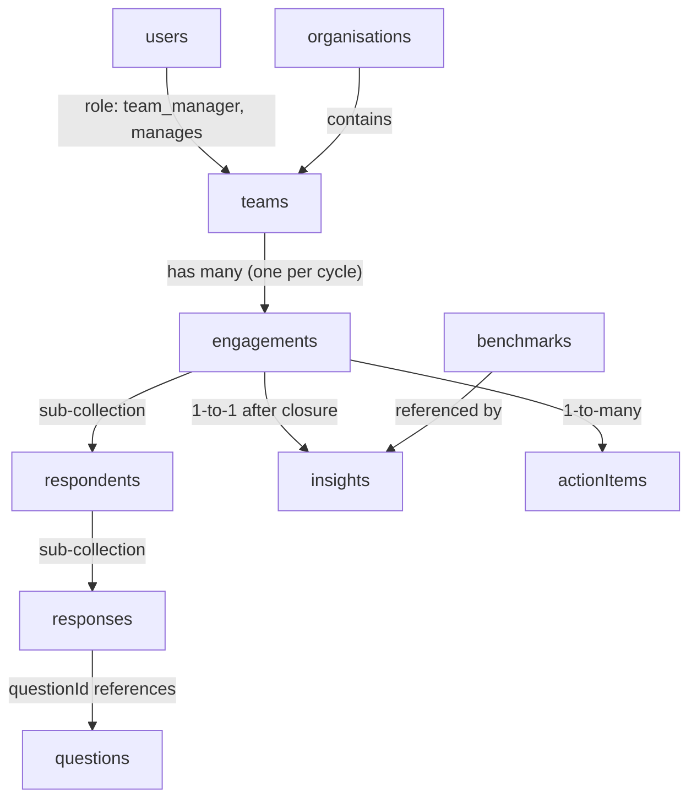

# Orbit � Data Model

All data is stored in Firebase Firestore. Collections use Firestore document IDs as primary keys. Firebase Authentication UIDs are used as document IDs in the `users` collection. All timestamps are Firestore `Timestamp` objects.

**Production Firebase project:** **`orbit-oaklin`**, with **Firestore located in London** (Google Cloud region **`europe-west2`**). Data residency and replication for Firestore follow Google�s policies for that region; the location is fixed at database creation time.

---

## Collection Overview

---

## 1. `users`

**What it is:** One document per authenticated user of the platform. This collection covers Oaklin admins and team managers. Team members are not stored here � they interact without an account.

**Document ID:** Firebase Authentication UID

| Field           | Type      | Description                                                              |
|-----------------|-----------|--------------------------------------------------------------------------|
| `uid`           | `string`  | Firebase Auth UID (mirrors the document ID)                              |
| `email`         | `string`  | User's email address                                                     |
| `displayName`   | `string`  | Full name                                                                |
| `role`          | `string`  | `"oaklin_admin"` or `"team_manager"`                                    |
| `organisationId`| `string`  | ID of the organisation this manager belongs to (null for Oaklin admins) |
| `createdAt`     | `Timestamp` | When the account was created                                           |
| `invitedBy`     | `string`  | UID of the Oaklin admin who created this user                            |

**Relationships:** `organisationId` references an `organisations` document. A team manager is linked to a specific team via the `teams` collection.

**Access rules:**
- A team manager can read their own document only.
- Oaklin admins can read and write all user documents.

---

## 2. `organisations`

**What it is:** One document per client organisation. An organisation can contain one or more teams. Oaklin admins create organisations through the admin portal.

**Document ID:** Auto-generated Firestore ID

| Field         | Type        | Description                                                         |
|---------------|-------------|---------------------------------------------------------------------|
| `name`        | `string`    | Full name of the organisation (e.g. "Acme Financial Services")      |
| `industry`    | `string`    | Industry category (e.g. "Financial Services", "Healthcare", "Retail") |
| `createdAt`   | `Timestamp` | When the organisation record was created                            |
| `createdBy`   | `string`    | UID of the Oaklin admin who created the record                      |

**Relationships:** One organisation has many `teams`.

**Access rules:**
- Oaklin admins: full read/write.
- Team managers: read only, scoped to their own `organisationId`.

---

## 3. `teams`

**What it is:** One document per team within an organisation. A team is the primary unit of a diagnostic engagement. Each team has a designated manager.

**Document ID:** Auto-generated Firestore ID

| Field           | Type        | Description                                                          |
|-----------------|-------------|----------------------------------------------------------------------|
| `organisationId`| `string`    | ID of the parent organisation                                        |
| `name`          | `string`    | Team name (e.g. "Operations Team", "Client Services")                |
| `function`      | `string`    | Office function: `"back"`, `"middle"`, or `"front"`                 |
| `size`          | `number`    | Number of people in the team (used for benchmarking)                 |
| `managerId`     | `string`    | Firebase Auth UID of the team manager                                |
| `createdAt`     | `Timestamp` | When the team was created                                            |
| `createdBy`     | `string`    | UID of the Oaklin admin who created the team                         |

**Relationships:** Belongs to one `organisations` document. Has one `users` record as manager. Has many `engagements`.

**Access rules:**
- Oaklin admins: full read/write.
- Team managers: read only, scoped to teams where `managerId` matches their UID.

---

## 4. `engagements`

**What it is:** One document per survey cycle for a team. An engagement tracks the entire lifecycle of a diagnostic � from setup through survey completion to analysis and reporting. Each time a team runs the diagnostic, a new engagement is created.

**Document ID:** Auto-generated Firestore ID

| Field               | Type        | Description                                                                        |
|---------------------|-------------|------------------------------------------------------------------------------------|
| `teamId`            | `string`    | ID of the team being assessed                                                      |
| `organisationId`    | `string`    | ID of the parent organisation (denormalised for efficient portfolio queries)       |
| `status`            | `string`    | Lifecycle state: `"draft"`, `"active"`, `"closed"`, `"analysed"`                 |
| `memberShareToken`  | `string`    | Unique random token used in the shared survey link for all team members            |
| `managerSurveyToken`| `string`    | Unique random token for the manager's survey access (separate from dashboard login)|
| `questionSetVersion`| `string`    | Version identifier of the question bank used (supports future question bank changes)|
| `createdAt`         | `Timestamp` | When the engagement was created                                                    |
| `activatedAt`       | `Timestamp` | When the engagement was set to active (survey links become live)                   |
| `closedAt`          | `Timestamp` | When the Oaklin admin closed the engagement                                        |
| `analysedAt`        | `Timestamp` | When AI analysis completed successfully                                             |
| `createdBy`         | `string`    | UID of the Oaklin admin who created the engagement                                 |

**Relationships:** Belongs to `teams` and `organisations`. Has sub-collections `respondents` and `responses`. Has one `insights` document and many `actionItems`.

**Sub-collections:** `respondents` (see below)

**Access rules:**
- Oaklin admins: full read/write.
- Team managers: read only, scoped to their `teamId`.

---

## 5. `engagements/{engagementId}/respondents`

**What it is:** One document per person who has been invited or is expected to complete the survey for this engagement. This covers both the team manager and team members. For individually invited members (email), a respondent doc is created at invite time. For members using the shared link, a respondent doc is created when they begin the survey.

**Document ID:** Auto-generated Firestore ID

| Field            | Type        | Description                                                                        |
|------------------|-------------|------------------------------------------------------------------------------------|
| `engagementId`   | `string`    | ID of the parent engagement (denormalised for convenience)                         |
| `role`           | `string`    | `"manager"` or `"member"`                                                         |
| `name`           | `string`    | Respondent's name (provided at invite time or self-entered on the survey)          |
| `email`          | `string`    | Email address (nullable � not collected for shared-link respondents)               |
| `inviteToken`    | `string`    | Unique token for this respondent's survey link (used for individual email invites) |
| `accessMethod`   | `string`    | `"email_invite"` or `"shared_link"`                                               |
| `status`         | `string`    | `"invited"`, `"in_progress"`, or `"completed"`                                    |
| `invitedAt`      | `Timestamp` | When the invite was sent (nullable for shared-link respondents)                    |
| `startedAt`      | `Timestamp` | When the respondent first opened the survey                                        |
| `completedAt`    | `Timestamp` | When the respondent submitted all answers                                           |

**Relationships:** Belongs to one `engagements` document. Has a sub-collection `responses`.

**Sub-collections:** `responses` (see below)

**Access rules:**
- Oaklin admins: full read/write.
- No client-facing read access � respondent identity is not exposed to team managers.

---

## 6. `engagements/{engagementId}/respondents/{respondentId}/responses`

**What it is:** One document per question answered by a respondent. Responses are written progressively as the respondent moves through the survey, allowing partial saves and resumption.

**Document ID:** The `questionId` (so a response document can be directly fetched if its question ID is known, and so re-answering naturally overwrites the previous answer)

| Field          | Type        | Description                                                     |
|----------------|-------------|-----------------------------------------------------------------|
| `questionId`   | `string`    | ID of the question being answered (mirrors the document ID)     |
| `score`        | `number`    | Score selected by the respondent: integer between 1 and 5      |
| `answeredAt`   | `Timestamp` | When this response was last written or updated                  |

**Relationships:** Belongs to one `respondents` document. References one `questions` document via `questionId`.

**Access rules:**
- Write access allowed without authentication when a valid engagement token is present (enforced via a Firestore security rule checking token validity through a server-side write path).
- Oaklin admins: full read access for analysis and export.
- Team managers: no direct access to individual responses.

---

## 7. `questions`

**What it is:** The global, Oaklin-authored question bank. This collection is seeded by Oaklin and is not modified during normal platform operation. All engagements draw from the same question set (versioned). Questions are structured around three competencies and differentiated by respondent role.

**Document ID:** Auto-generated Firestore ID (also used as `questionSetVersion` reference)

| Field          | Type              | Description                                                                          |
|----------------|-------------------|--------------------------------------------------------------------------------------|
| `version`      | `string`          | Question bank version (e.g. `"v1"`) � allows future versioning without data loss    |
| `competency`   | `string`          | One of: `"people_relationships"`, `"growth_impact"`, `"purpose_alignment"`          |
| `role`         | `string`          | Who answers this question: `"manager"`, `"member"`, or `"both"`                    |
| `order`        | `number`          | Display order within its competency and role group                                   |
| `text`         | `string`          | The full question text shown to the respondent                                       |
| `criteria`     | `map`             | Score descriptions: `{ "1": "...", "2": "...", "3": "...", "4": "...", "5": "..." }` |
| `isActive`     | `boolean`         | Whether this question is included in current engagements                             |

**Relationships:** Referenced by `responses` documents via `questionId`.

**Access rules:**
- Oaklin admins: full read/write.
- Read access required for survey rendering (token-gated, server-side fetch).

---

## 8. `insights`

**What it is:** One document per engagement, written by the server after Claude completes its analysis when an engagement is closed. This document is the primary source for all dashboard visualisations and AI-generated narrative content. It is never overwritten after initial generation unless the Oaklin admin explicitly re-triggers analysis.

**Document ID:** Same as the `engagementId` (one-to-one relationship, easy lookup)

| Field                  | Type      | Description                                                                                      |
|------------------------|-----------|--------------------------------------------------------------------------------------------------|
| `engagementId`         | `string`  | ID of the engagement this insight belongs to                                                     |
| `teamId`               | `string`  | Denormalised team ID for efficient querying                                                      |
| `organisationId`       | `string`  | Denormalised organisation ID                                                                     |
| `competencyScores`     | `map`     | Aggregated average score per competency: `{ "people_relationships": 3.4, "growth_impact": 2.8, "purpose_alignment": 3.1 }` |
| `managerScores`        | `map`     | Manager-only average scores per competency (same structure)                                      |
| `memberScores`         | `map`     | Member-only average scores per competency (same structure)                                       |
| `respondentCount`      | `map`     | Count of completed respondents by role: `{ "manager": 1, "member": 12 }`                       |
| `aiSummary`            | `string`  | Claude-generated narrative overview of the team's diagnostic results                             |
| `keyStrengths`         | `array`   | Array of strings � top-performing areas identified by Claude                                     |
| `quickWins`            | `array`   | Array of objects: `{ title, description }` � immediate short-term opportunities                  |
| `strategicInitiatives` | `array`   | Array of objects: `{ title, description }` � longer-term recommended focus areas                 |
| `benchmarkComparison`  | `map`     | Per competency: `{ "people_relationships": { "score": 3.4, "industryAverage": 3.0, "bestInClass": 4.2, "delta": 0.4 } }` |
| `generatedAt`          | `Timestamp` | When Claude generated this insight document                                                    |
| `modelVersion`         | `string`  | Claude model version used (e.g. `"claude-3-5-sonnet-20241022"`) � for auditability             |

**Relationships:** One-to-one with `engagements`. References `benchmarks` data at generation time (deltas are stored, not re-computed).

**Access rules:**
- Oaklin admins: full read/write.
- Team managers: read only, scoped to their `teamId`.

---

## 9. `actionItems`

**What it is:** One document per recommended action, generated by Claude when an engagement is analysed. The team manager interacts with these documents to track progress. Oaklin admins can view and edit all action items across all engagements.

**Document ID:** Auto-generated Firestore ID

| Field           | Type        | Description                                                                                   |
|-----------------|-------------|-----------------------------------------------------------------------------------------------|
| `engagementId`  | `string`    | ID of the engagement this action belongs to                                                   |
| `teamId`        | `string`    | Denormalised team ID                                                                          |
| `organisationId`| `string`    | Denormalised organisation ID                                                                  |
| `title`         | `string`    | Short action title (e.g. "Run a structured team retrospective")                               |
| `description`   | `string`    | Full description of the action and its intended impact                                        |
| `competency`    | `string`    | Which competency this action primarily addresses                                              |
| `timeframe`     | `string`    | `"short_term"` (immediate / within weeks) or `"long_term"` (sustained / months)             |
| `priority`      | `number`    | AI-assigned priority order within its timeframe group (lower = higher priority)               |
| `status`        | `string`    | `"not_started"`, `"in_progress"`, or `"complete"`                                           |
| `assignedTo`    | `string`    | Name of the person responsible (free text, entered by the manager)                            |
| `dueDate`       | `Timestamp` | Optional target completion date set by the manager                                            |
| `source`        | `string`    | `"ai_generated"` or `"manual"` (reserved for future manual action creation)                  |
| `createdAt`     | `Timestamp` | When the action was written to Firestore                                                      |
| `updatedAt`     | `Timestamp` | When the action was last modified                                                             |

**Relationships:** Belongs to one `engagements` document.

**Access rules:**
- Oaklin admins: full read/write.
- Team managers: read and update their own team's action items (`status`, `assignedTo`, `dueDate` fields only). Cannot delete.

---

## 10. `benchmarks`

**What it is:** Static reference data authored and seeded by Oaklin, providing industry average and best-in-class scores per competency, broken down by industry, office function, and team size range. Where gaps exist, Claude generates plausible supplementary values at engagement analysis time, which are also written here.

**Document ID:** A composite key for uniqueness and easy lookup � format: `{industry}__{function}__{sizeRange}` (e.g. `financial_services__back__10-25`)

| Field              | Type        | Description                                                                                      |
|--------------------|-------------|--------------------------------------------------------------------------------------------------|
| `industry`         | `string`    | Industry category matching the `organisations.industry` field                                    |
| `function`         | `string`    | Office function: `"back"`, `"middle"`, or `"front"`                                             |
| `sizeRange`        | `string`    | Team size band: e.g. `"1-10"`, `"11-25"`, `"26-50"`, `"51+"`                                  |
| `competencyScores` | `map`       | Per-competency benchmark figures: `{ "people_relationships": { "industryAverage": 3.0, "bestInClass": 4.2 }, ... }` |
| `source`           | `string`    | `"oaklin_authored"` or `"ai_supplemented"`                                                      |
| `updatedAt`        | `Timestamp` | When this benchmark record was last updated                                                      |
| `updatedBy`        | `string`    | UID of the admin who last updated this record, or `"claude"` if AI-supplemented                 |

**Relationships:** Referenced by the analysis process that generates `insights` documents. Not directly linked by a Firestore reference � matched by industry + function + size range at analysis time.

**Access rules:**
- Oaklin admins: full read/write.
- No client-facing read access (benchmark figures are embedded into `insights` documents at generation time).

---

## Security Model Summary

| Role         | `users` | `organisations` | `teams` | `engagements` | `respondents` | `responses` | `questions` | `insights` | `actionItems` | `benchmarks` |
|--------------|---------|-----------------|---------|---------------|---------------|-------------|-------------|------------|----------------|--------------|
| Oaklin Admin | R/W     | R/W             | R/W     | R/W           | R/W           | R/W         | R/W         | R/W        | R/W            | R/W          |
| Team Manager | Own only| Own org (R)     | Own (R) | Own team (R)  | None          | None        | R (server)  | Own (R)    | Own (R/partial W)| None       |
| Team Member  | None    | None            | None    | None          | Own (W via token)| W via token| R (server) | None       | None           | None         |

_Partial W for team managers on `actionItems` means they can update `status`, `assignedTo`, and `dueDate` fields only._

---

## Denormalisation Notes

Several fields are deliberately duplicated across collections (e.g. `organisationId` on `engagements`, `teamId` on `insights` and `actionItems`). This is intentional in Firestore to:

1. Enable efficient portfolio-level queries without requiring collection group queries or client-side joins
2. Allow Oaklin admin views to filter and display cross-team data in a single query
3. Reduce the number of reads required to render the dashboard

The tradeoff is that if an organisation or team is renamed, the denormalised fields may need updating � acceptable for this use case given that renames are rare admin operations.
